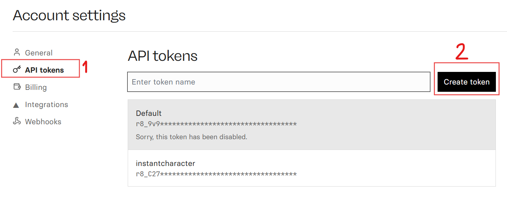
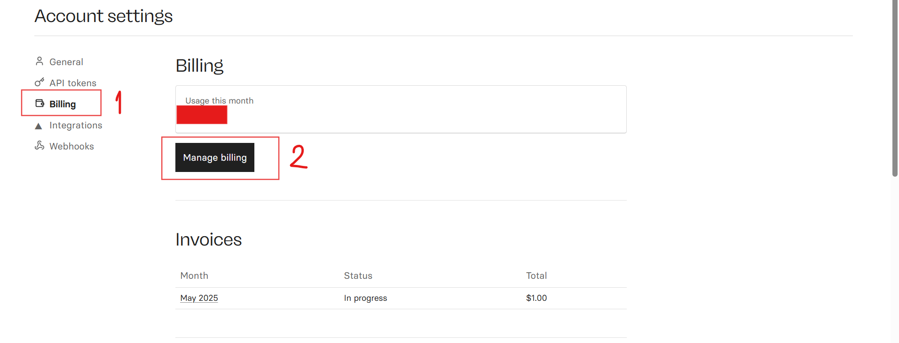
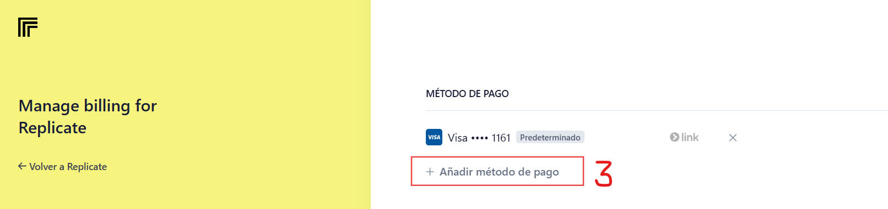
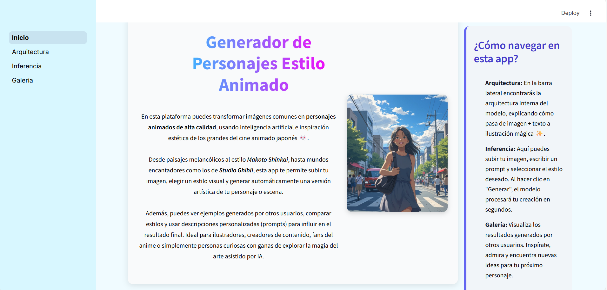
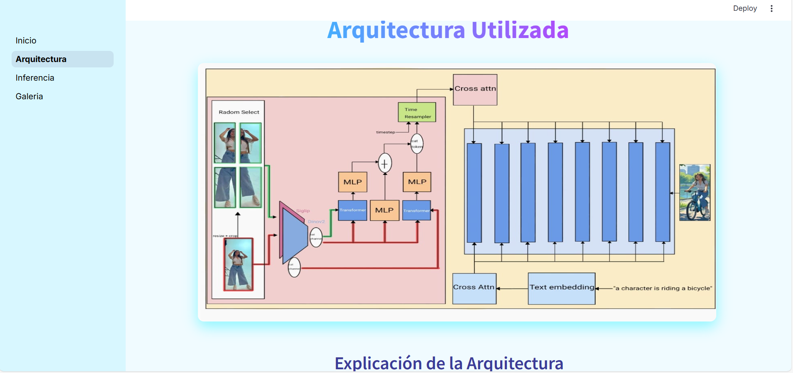
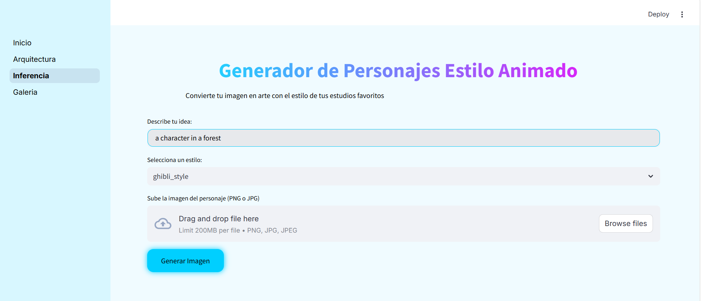
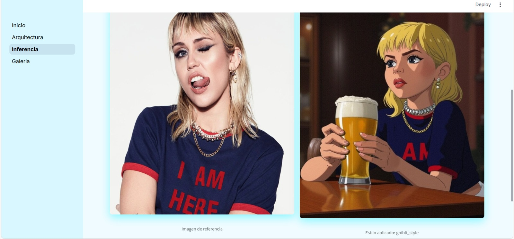

#  InstantCharacter - Implementación sencilla


Este proyecto es una **implementación simplificada** del artículo _"InstantCharacter: Personaliza cualquier personaje con un marco transformador de difusión escalable"_, utilizando **Streamlit** para la inferencia visual y **Docker** para su despliegue local en un entorno completamente aislado.

La aplicación permite cargar una imagen de referencia y una instrucción textual para generar una nueva imagen personalizada del personaje.

---

##  ¿Qué hace InstantCharacter?

**InstantCharacter** es un modelo generativo basado en **Diffusion Transformers (DiT)**, que permite:

- Capturar la **identidad visual** de un personaje desde una sola imagen.
- Aplicar esa identidad a nuevos escenarios, acciones, poses o estilos.
- Mantener **consistencia visual**, estilo y control desde texto.
- Generar imágenes de alta calidad sin necesidad de reentrenamiento por personaje.

---

##  Resumen teórico y arquitectura

- El modelo reemplaza la clásica arquitectura **U-Net** con un **transformador de difusión (DiT)** para mayor capacidad y flexibilidad.
- Integra un **adaptador escalable**, compuesto por transformadores apilados, que refina progresivamente las características del personaje.
- Emplea atención cruzada (Q, K, V) para fusionar la imagen de referencia con el texto durante la generación.
- Se separa la **identidad del personaje** del **contenido generado**, permitiendo una personalización precisa sin ajustes costosos.
- Este enfoque logra resultados de **alta fidelidad y control textual**, incluso con personajes no vistos en el entrenamiento.

---

##  Ejecución con Docker (recomendado)

Instala Python : [Python Downloads](https://www.python.org/downloads/)
Instala Docker : [Docker Downloads](https://www.docker.com/)

Una vez instalado, abre Docker Desktop.

Antes de ejecutar la aplicación, es **necesario obtener un token API** para el servicio:

**1. Ve a la página:**  
   [https://internal.replicate.com/tuannha/instant-character](https://internal.replicate.com/tuannha/instant-character)  

**2. Inicia sesión y genera tu **API token** en la sección correspondiente:**



**3. Configura tu medio de pago:**




**4. Crea un archivo `.env` en la raíz del proyecto con el siguiente contenido (reemplaza `tu_token_aqui` con tu token real):**

```env
REPLICATE_API_TOKEN=tu_token_aqui
```

No necesitas lanzar Streamlit manualmente ni activar un entorno virtual. Todo se gestiona automáticamente desde Docker.
Pero si es de tu preferencia puedes crear el entorno virtual con el comando 

```bash
python -m venv venv
```

Activar entorno virtual
**En Windows:**
```bash
venv\Scripts\activate
```

**En macOS/Linux:**
```bash
source venv/bin/activate
```

**Instala las librerías necesarias:**
```bash
pip install -r requirements.txt
```

### 🐳 Paso a paso con Docker:

**1. Construye la imagen:**

```bash
docker build -t instant-character-app .
```

**2. Ejecuta el contenedor:**

```bash
docker run --env-file .env -p 8501:8501 instant-character-app
```

**3. Abre tu navegador en:**  
👉 `http://localhost:8501`

Una vez ingreses, verás que la app consta de 4 páginas:
   1. **Inicio:**
   

   2. **Arquitectura:** aquí encontrarás información explicada sobre la arquitectura utilizada.
   

   3. **Inferencia:** en esta parte podrás hacer tu inferencia
   

   4. **Galería:** aquí encontrarás algunas imagenes de referencia, y todas tus creaciones se almacenarán aquí.
   


---

**4. Usa la app:**

   - Ingresa a la pestaña de **Inferencia**
   - Escoge uno de los estilos disponibles: **Makoto** o **Ghibli**.
   - Sube una imagen del personaje que quieres personalizar.
   - Escribe un *prompt* con la situación o escenario en el que quieres ver a tu personaje  
     *(por ejemplo: `"Tomando cerveza en un bar"`)*.
   - Una vez le das al botón de "Generar Imagen", tu salida se verá algo así:
      


##  Estructura del proyecto

```
InstantCharacter/
│
├── data/                         # Carpeta con imagenes usadas para la interfaz
├── imagenes/                     #Carptea con algunas imagenes usadas para la interfaz
├── imagenes_generadas/          # Carpeta donde se guardan las imágenes generadas
│
├── pages/                        # Scripts para navegación en múltiples vistas de Streamlit
│   ├── 1_Arquitectura.py         # Explicación visual de la arquitectura
│   ├── 2_Inferencia.py           # Lógica de inferencia y generación de imágenes
│   └── 3_Galeria.py              # Galería de imágenes generadas
│
├── venv/                         # Entorno virtual 
│
├── .env                          # Variable de entorno (Token)
├── .gitignore                    # Archivos/Carpetas ignoradas por Git
├── Dockerfile                    # Configuración para contenedor Docker
├── Inicio.py                     # Punto de entrada principal de la app Streamlit
├── README.md                     # Documentación del proyecto
├── requirements.txt              # Lista de dependencias del proyecto
└── styles.py                     # Archivo con estilos CSS personalizados

```


---

## 👩‍💻 Autoras del proyecto

Este proyecto fue desarrollado por:

- **María de los Ángeles Amú Moreno** [@mdlangeles](https://github.com/mdlangeles)
- **Manuela Mayorga Rojas**  [@ManuelaMayorga](https://github.com/ManuelaMayorga)
- **Mariana Mera Gutierrez** [@MarianaMera12](https://github.com/MarianaMera12)

Como parte de una implementación práctica del artículo _"InstantCharacter"_, enfocada en la fase de inferencia y visualización con herramientas accesibles.

---

##  Referencia

📄 Tao, J., Zhang, Y., Wang, Q., et al. (2024). *InstantCharacter: Personaliza cualquier personaje con un marco transformador de difusión escalable*.  
🔗 [Repositorio oficial del paper](https://github.com/Tencent/InstantCharacter)

---

Si tienes alguna duda, no dudes en contactarnos ✨


